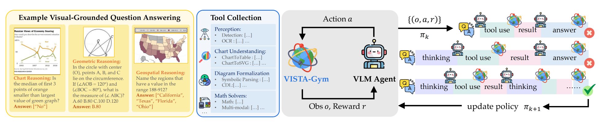

# Scaling Agentic Reinforcement Learning for Tool-Integrated Reasoning in VLMs

📑**Contents**  
- [📖 Overview](#-overview)
- [🔧 Installation](#-installation)
- [⚡ Quick Start](#-quick-start)
- [🚀 Full Training Pipeline](#-full-training-pipeline)
  - [📦 Step 1: Preparing Preprocessed Data](#-step-1-preparing-preprocessed-data)
  - [🧠 Step 2: Supervised Fine-Tuning](#-step-2-supervised-fine-tuning)
  - [🎯 Step 3: Reinforcement Learning (GRPO)](#-step-3-reinforcement-learning-grpo)
    - [3.1 Preprocess Training Data](#31-preprocess-training-data)
    - [3.2 Run GRPO Training](#32-run-grpo-training)
  - [✅ Step 4: Run Inference on Test Set](#-step-4-run-inference-on-test-set)
- [🏆 Project Info](#-project-info)

📖**OverView**  
While recent vision-language models (VLMs) demonstrate strong image understanding, their ability to ``think with images,'' i.e., to reason through multi-step visual interactions, remains limited. 
We introduce VISTA-Gym, a scalable training environment for incentivizing tool-integrated visual reasoning capabilities in VLMs. 
VISTA-Gym unifies diverse real-world multimodal reasoning tasks (7 tasks from 13 datasets in total) with a standardized interface for visual tools (\eg, grounding, parsing), executable interaction loops, verifiable feedback signals, and efficient trajectory logging, enabling visual agentic reinforcement learning at scale.
While recent VLMs exhibit strong text-only reasoning, both proprietary and open-source models still struggle with tool selection, invocation, and coordination. 
With VISTA-Gym, we train VISTA-R1 to interleave tool-use with agentic reasoning via multi-turn trajectory sampling and end-to-end reinforcement learning.
Extensive experiments across 11 public reasoning-intensive VQA benchmarks show that VISTA-R1-8B outperforms state-of-the-art baselines with similar sizes by 9.51\%-18.72\%, demonstrating VISTA-Gym as an effective training ground to unlock the tool-integrated reasoning capabilities for VLMs.

⚙️ **Installation** 
