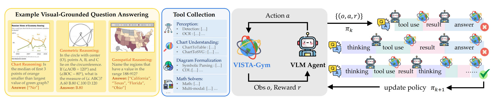

# Scaling Agentic Reinforcement Learning for Tool-Integrated Reasoning in VLMs

📃 [Paper](https://arxiv.org/pdf/2511.19773) | 🤗 [Models & Tools](https://huggingface.co/LuKasatvt/VistaGym) | 💻 [Code](https://github.com/Lucanyc/VISTA-Gym)

📑 **Contents**
- [📖 Overview](#-overview)
- [⚙️ Installation](#-installation)
- [🗺️ VISTA-Gym](#-vista-gym)
- [🚀 Full Training Pipeline](#-full-training-pipeline)
  - [🧠 Step 1: Supervised Fine-Tuning](#-step-1-supervised-fine-tuning)
  - [🎯 Step 2: Reinforcement Learning (GRPO)](#-step-2-reinforcement-learning-grpo)
- [🏆 Project Info](#-project-info)

---

## 📖 Overview

While recent vision-language models (VLMs) demonstrate strong image understanding, their ability to "think with images" — to reason through multi-step visual interactions — remains limited.

We introduce **VISTA-Gym**, a scalable training environment for incentivizing tool-integrated visual reasoning capabilities in VLMs. VISTA-Gym unifies diverse real-world multimodal reasoning tasks (7 task types across 13 datasets) with a standardized interface for visual tools (e.g., grounding, parsing), executable interaction loops, verifiable feedback signals, and efficient trajectory logging, enabling visual agentic reinforcement learning at scale. With VISTA-Gym, we train **VISTA-R1** to interleave tool-use with agentic reasoning via multi-turn trajectory sampling and end-to-end reinforcement learning. 



---

## ⚙️ Installation

### Gym setup

```bash
git clone https://github.com/Lucanyc/vista-gym.git
cd vista-gym
pip install -e .
```

### Build Docker Container

Since our gym environment relies on a Docker container for isolated coding and execution, you may first build the Docker image.
```bash
docker buildx build -t vlm_gym:latest .
```

Then, create and start the container:
```bash
docker run -it --name vlm_docker_unified vlm_gym:latest
```

If the container already exists, you can start it directly:
```bash
docker start vlm_docker_unified
```

To enter the running container:
```bash
docker exec -it vlm_docker_unified bash
```

### Training setup

We follow the verl/verl-tool environment: [TIGER-AI-Lab/verl-tool](https://github.com/TIGER-AI-Lab/verl-tool/tree/main/verl_tool)

### Tool setup

> *Coming soon*


| Model | HuggingFace Link | Usage |
|---|---|---|
| ChartMoE | [🤗 LuKasatvt/VistaGym/ChartMoE](https://huggingface.co/LuKasatvt/VistaGym/tree/main/chartmoe) | `--chartmoe-model "LuKasatvt/VistaGym"` |
| MultiMath | [🤗 LuKasatvt/VistaGym/MultiMath](https://huggingface.co/LuKasatvt/VistaGym/tree/main/multimath) | `--enable-multimath` |
| GLLaVA | [🤗 LuKasatvt/VistaGym/GLLaVA](https://huggingface.co/LuKasatvt/VistaGym/tree/main/gllava) | `--enable-gllava` |
| EasyOCR | [🤗 LuKasatvt/VistaGym/EasyOCR](https://huggingface.co/LuKasatvt/VistaGym/tree/main/easyocr) | `--enable-easyocr` |
| Qwen2.5-VL-7B | [🤗 Qwen/Qwen2.5-VL-7B-Instruct](https://huggingface.co/Qwen/Qwen2.5-VL-7B-Instruct) | `--model Qwen/Qwen2.5-VL-7B-Instruct` |
| InternVL3-8B | [🤗 OpenGVLab/InternVL3-8B-Instruct](https://huggingface.co/OpenGVLab/InternVL3-8B-Instruct) | `--model OpenGVLab/InternVL3-8B-Instruct` |
| ... | More models supported | |

## 🗺️ VISTA-Gym

A scalable reinforcement learning gym for training tool-integrated visual reasoning in VLMs. Drop in any benchmark, any VLM, and evaluate with reflection and tool-augmented reasoning.

**Core components:**

| Directory | Description |
|---|---|
| `vlm_gym/environments/` | Pluggable vision-QA environments (ChartQA, ScienceQA, Geometry3K, etc.) |
| `vlm_gym/agents/` | VLM agent implementations (Qwen2.5-VL-7B-Instruct, InternVL3-8B, etc.) |
| `vlm_gym/environments/tools/` | Visual tools (ChartMoE, DeepEyes, GroundingDINO, EasyOCR, SAM2, etc.) |
| `vlm_gym/tasks/` | Task-specific reasoning, evaluation, and feedback components |
| `scripts/` | Evaluation entry points |
| `data_adapters/` | Dataset converters to unified vlmgym format |

### Gym Interaction

The gym follows a standard environment-agent loop: the environment sends an observation (image + question), the agent returns an action (predicted answer), and the environment provides feedback for retry.

```
Environment (ChartQA)            Agent (VLM)
    │                                │
    │──── obs: image + question ────►│
    │                                │
    │◄─── action: <think>...</think> │
    │           <answer>Yes</answer> │
    │                                │
    │   [if wrong & reflection on]   │
    │                                │
    │──── feedback + retry ─────────►│
    │◄─── action: revised answer ─── │
    │                                │
    │   reward: 1.0 (correct)        │
```

| Tool | Description | Flag |
|---|---|---|
| ChartMoE | Chart data extraction (to_table, extract_data, describe) | `--enable-chartmoe` |
| DeepEyes | Image zoom/magnification for fine-grained visual analysis | `--enable-deepeyes` |
| Grounding DINO | Object detection and grounding | `--config-experiment chartqa_grounding` |
| EasyOCR | Optical character recognition | `--enable-easyocr` |
| SAM2 | Segment Anything 2 for image segmentation | `--enable-sam2` |
| MultiMath | Mathematical reasoning tool | `--enable-multimath` |
...


### Data Preparation

Convert ChartQA to vlmgym format:

```bash
python data_adapters/convert_chartqa_to_vlmgym.py
```

### Run ChartQA Evaluation with Reflection

```bash
python scripts/run_chartqa_eval_reflection_with_tool.py \
  --annotation data/chartqa/converted_train/train_human_vlmgym_container.json \
  --data-root data/chartqa \
  --model Qwen/Qwen2.5-VL-7B-Instruct \
  --enable-reflection \
  --max-attempts 3 \
  --numerical-tolerance 0.05 \
  --limit 50
```

### Run with Tool-Augmented Reasoning

```bash
python scripts/run_chartqa_eval_reflection_with_tool.py \
    --annotation data/chartqa/converted_train/train_human_vlmgym_container.json \
    --data-root data/chartqa \
    --model Qwen/Qwen2.5-VL-7B-Instruct \
    --enable-chartmoe \
    --chartmoe-model "/workspace/mathvista/model" \
    --chartmoe-device cuda \
    --use-structured-output \
    --enable-reflection \
    --max-attempts 3 \
    --limit 50

```


### Requirements

- Python 3.10+
- Linux, CUDA 12, NVIDIA GPU (80GB+ recommended for training; inference requires ~20GB for 7B model)
- PyTorch 2.0+
- Transformers 4.40+

---

## 🚀 Full Training Pipeline

We release training code for both **Qwen** (via verl) and **InternVL** families.

### 🧠 Step 1: Supervised Fine-Tuning

We use the official [InternVL3.0 training framework](https://internvl.readthedocs.io/en/latest/internvl3.0/deployment.html) for supervised fine-tuning. Please see `config` folder for the example configs used.


### 🎯 Step 2: Reinforcement Learning (GRPO)

> *Coming soon*

---

## 🏆 Project Info

### References

- verl-tool — [TIGER-AI-Lab/verl-tool](https://github.com/TIGER-AI-Lab/verl-tool)
- Qwen2.5-VL — [Qwen/Qwen2.5-VL-7B-Instruct](https://huggingface.co/Qwen/Qwen2.5-VL-7B-Instruct)
